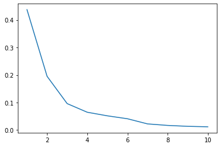
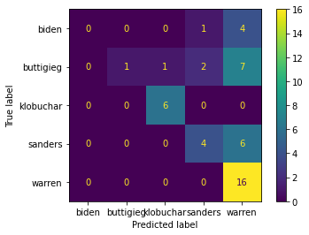
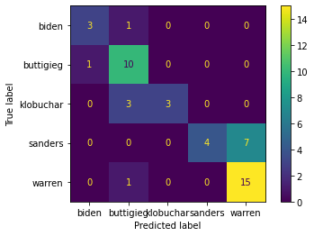

# Phase 4 Code Challenge Review: PCA and NLP


```python
from src.student_caller import one_random_student
from src.student_list import quanggang 
```

TOC:

  - [PCA](#pca)
  - [NLP](#nlp)


<a id='pca'></a>

# PCA

When creating principle components, PCA aims to find a vector in the direction of our feature space that is fit to what?

> Your answer here


```python
one_random_student(quanggang)
```

    Christos


How is the 1st principle component related to the 2nd?

> Your answer here


```python
one_random_student(quanggang)
```

    Christos


What are some reasons for using PCA?


> Your answer here


```python
one_random_student(quanggang)
```

    Christos


```python
#__SOLUTION__
'''PCA can combat the curse of dimensionality.  
The curse of dimensionality occurs when there are a large number of features in a dataset.
Having too many features can mean that the signal of features can be lost.'''
```

> Your answer here


```python
one_random_student(quanggang)
```

    Christos


```python
#__SOLUTION__
"""PCA can help with interpretability of coefficients.  
Because all the features are created orthagonally to one another, 
PCA ensures that there is no multicollinearity.

"""
```

> Your answer here


```python
one_random_student(quanggang)
```

    Christos


```python
#__SOLUTION__
'''PCA can be useful for visualization.  
Because you can reduce the feature space to two or three dimensions, 
you can make plots that show things such as the decision boundary or the grouping of clusters.
'''
```

> Your answer here


```python
one_random_student(quanggang)
```

    Christos


```python
#__SOLUTION__
"""PCA may help combat overfitting.  
You are essentially simplifying the model to a certain number of features.
Reducing the complexity of the model can reduce variance"""
```


```python
#__SOLUTION__
'Can help reduce computing time'
```


    'Can help reduce computing time'


How can one determine how many principle components to use in a model?

> Your answer here


```python
one_random_student(quanggang)
```

    Christos


```python
#__SOLUTION__
"""We can look at the explained variance ratio. 
The explained variance ratio lookes at how much variance is explained by each component.  
The explained variance will always go up with more components, 
so choose components where we see the explained variance stop increasing significantly.
Make a plot that helps you choose a good number of components."
```


```python
# Now let's implement PCA in code.
```


```python
driver = one_random_student(quanggang)
```

    Christos


```python
import pandas as pd
from sklearn.datasets import  load_breast_cancer
data = load_breast_cancer()
X = pd.DataFrame(data['data'], columns = data['feature_names'])
X.head()
```


<div>
<style scoped>
    .dataframe tbody tr th:only-of-type {
        vertical-align: middle;
    }

    .dataframe tbody tr th {
        vertical-align: top;
    }

    .dataframe thead th {
        text-align: right;
    }
</style>
<table border="1" class="dataframe">
  <thead>
    <tr style="text-align: right;">
      <th></th>
      <th>mean radius</th>
      <th>mean texture</th>
      <th>mean perimeter</th>
      <th>mean area</th>
      <th>mean smoothness</th>
      <th>mean compactness</th>
      <th>mean concavity</th>
      <th>mean concave points</th>
      <th>mean symmetry</th>
      <th>mean fractal dimension</th>
      <th>...</th>
      <th>worst radius</th>
      <th>worst texture</th>
      <th>worst perimeter</th>
      <th>worst area</th>
      <th>worst smoothness</th>
      <th>worst compactness</th>
      <th>worst concavity</th>
      <th>worst concave points</th>
      <th>worst symmetry</th>
      <th>worst fractal dimension</th>
    </tr>
  </thead>
  <tbody>
    <tr>
      <th>0</th>
      <td>17.99</td>
      <td>10.38</td>
      <td>122.80</td>
      <td>1001.0</td>
      <td>0.11840</td>
      <td>0.27760</td>
      <td>0.3001</td>
      <td>0.14710</td>
      <td>0.2419</td>
      <td>0.07871</td>
      <td>...</td>
      <td>25.38</td>
      <td>17.33</td>
      <td>184.60</td>
      <td>2019.0</td>
      <td>0.1622</td>
      <td>0.6656</td>
      <td>0.7119</td>
      <td>0.2654</td>
      <td>0.4601</td>
      <td>0.11890</td>
    </tr>
    <tr>
      <th>1</th>
      <td>20.57</td>
      <td>17.77</td>
      <td>132.90</td>
      <td>1326.0</td>
      <td>0.08474</td>
      <td>0.07864</td>
      <td>0.0869</td>
      <td>0.07017</td>
      <td>0.1812</td>
      <td>0.05667</td>
      <td>...</td>
      <td>24.99</td>
      <td>23.41</td>
      <td>158.80</td>
      <td>1956.0</td>
      <td>0.1238</td>
      <td>0.1866</td>
      <td>0.2416</td>
      <td>0.1860</td>
      <td>0.2750</td>
      <td>0.08902</td>
    </tr>
    <tr>
      <th>2</th>
      <td>19.69</td>
      <td>21.25</td>
      <td>130.00</td>
      <td>1203.0</td>
      <td>0.10960</td>
      <td>0.15990</td>
      <td>0.1974</td>
      <td>0.12790</td>
      <td>0.2069</td>
      <td>0.05999</td>
      <td>...</td>
      <td>23.57</td>
      <td>25.53</td>
      <td>152.50</td>
      <td>1709.0</td>
      <td>0.1444</td>
      <td>0.4245</td>
      <td>0.4504</td>
      <td>0.2430</td>
      <td>0.3613</td>
      <td>0.08758</td>
    </tr>
    <tr>
      <th>3</th>
      <td>11.42</td>
      <td>20.38</td>
      <td>77.58</td>
      <td>386.1</td>
      <td>0.14250</td>
      <td>0.28390</td>
      <td>0.2414</td>
      <td>0.10520</td>
      <td>0.2597</td>
      <td>0.09744</td>
      <td>...</td>
      <td>14.91</td>
      <td>26.50</td>
      <td>98.87</td>
      <td>567.7</td>
      <td>0.2098</td>
      <td>0.8663</td>
      <td>0.6869</td>
      <td>0.2575</td>
      <td>0.6638</td>
      <td>0.17300</td>
    </tr>
    <tr>
      <th>4</th>
      <td>20.29</td>
      <td>14.34</td>
      <td>135.10</td>
      <td>1297.0</td>
      <td>0.10030</td>
      <td>0.13280</td>
      <td>0.1980</td>
      <td>0.10430</td>
      <td>0.1809</td>
      <td>0.05883</td>
      <td>...</td>
      <td>22.54</td>
      <td>16.67</td>
      <td>152.20</td>
      <td>1575.0</td>
      <td>0.1374</td>
      <td>0.2050</td>
      <td>0.4000</td>
      <td>0.1625</td>
      <td>0.2364</td>
      <td>0.07678</td>
    </tr>
  </tbody>
</table>
<p>5 rows × 30 columns</p>
</div>


```python
# This code instruction is intentionally sparse. As a group, walk through the steps of fitting a PCA object. 
# Start with just one principle component, and discuss as a group whether reducing our data
# to 1 principle component would be advisable to feed into an algorithm. 
# Perform model all model building steps as you usually would.
# Experiment with different parameters, and inspect important attributes of the object after fitting.


```


```python

#__SOLUTION__
"""Wrong solution b/c of no scaling"""
from sklearn.decomposition import PCA
from sklearn.preprocessing import StandardScaler


# instantiate a PCA object, and determine how much variance is explained by the first principal component.
from sklearn.model_selection import train_test_split

X_train, X_test, y_train, y_test = train_test_split(X,y,random_state=42)
pca_1 = PCA(n_components=1)
#ss = StandardScaler()
 
pca_1.fit(X_train)

sum(pca_1.explained_variance_ratio_)
```


    0.9818124290360914


```python
#__SOLUTION__
'''Looking at the components of a PCA object without scaling, we see that area is much larger.  Let us look at X.describe()'''
pca_1.components_
```


    array([[ 5.11157769e-03,  2.02572144e-03,  3.51774640e-02,
             5.24785181e-01,  4.37237521e-06,  3.74682600e-05,
             7.96622375e-05,  4.65437990e-05,  8.04117091e-06,
            -3.02201929e-06,  3.21671661e-04, -4.27906307e-05,
             2.27254345e-03,  5.78600982e-02, -6.80381229e-07,
             4.71335909e-06,  8.50572086e-06,  3.17526077e-06,
            -7.74887786e-07, -1.98850370e-07,  7.07676088e-03,
             2.89659323e-03,  4.86797536e-02,  8.47084134e-01,
             6.41856188e-06,  8.84930424e-05,  1.60369243e-04,
             7.07854059e-05,  1.90999538e-05,  2.57616027e-07]])


```python
#__SOLUTION__
pca = PCA(n_components=10)
ss = StandardScaler()
X_tr_sc = ss.fit_transform(X_train)
pca.fit(X_tr_sc)
pca.explained_variance_ratio_
```


    array([0.4373648 , 0.1953137 , 0.09618005, 0.06482796, 0.05180713,
           0.04118451, 0.0225213 , 0.01698476, 0.0137072 , 0.01197057])


```python
#__SOLUTION__
import matplotlib.pyplot as plt
plt.plot(range(1,11), pca.explained_variance_ratio_)
```


    [<matplotlib.lines.Line2D at 0x15fbc50d0>]





<a id='nlp'></a>


# NLP

For NLP data, what is the entire data of records called?

> your answer here


```python
one_random_student(quanggang)
```

    Christos


What is an individual record called?

> your answer here


```python
one_random_student(quanggang)
```

    Christos


What is a group of two words that appear next to one-another in a document?

> Your answer here

What is a high frequency, semantically low value word called? 

> Your answer here


```python
one_random_student(quanggang)
```

    Christos


List the preprocessing steps we can employ to create a cleaner feature set to our models.

> Your answer here


```python
one_random_student(quanggang)
```

    Christos


What sklearn tools do we have at our disposal to turn our raw text into numerical representations?

> Your Answer here

Explain the difference between the two main vectorizors we employ to transform the data into the document-term matrix.

> Your answer here


```python
one_random_student(quanggang)
```

    Christos


What form do the two main vectorizors expect our data to be fed to them?

> Your answer here

Now let's write some code.


```python
# As a group, preprocess the data using an appropriate cross-validation strategy. 
# Test out different parameters in the vectorizer of choice
# Select a model and score it on the test set.
# If we have time.  Look at the frequency distributions of the words for a specific candidate.
```


```python
driver = one_random_student(quanggang)
```

    Rachel


```python
policies = pd.read_csv('data/2020_policies_feb_24.csv')
policies.head()
```


<div>
<style scoped>
    .dataframe tbody tr th:only-of-type {
        vertical-align: middle;
    }

    .dataframe tbody tr th {
        vertical-align: top;
    }

    .dataframe thead th {
        text-align: right;
    }
</style>
<table border="1" class="dataframe">
  <thead>
    <tr style="text-align: right;">
      <th></th>
      <th>Unnamed: 0</th>
      <th>name</th>
      <th>policy</th>
      <th>candidate</th>
    </tr>
  </thead>
  <tbody>
    <tr>
      <th>0</th>
      <td>0</td>
      <td>100% Clean Energy for America</td>
      <td>As published on Medium on September 3rd, 2019:...</td>
      <td>warren</td>
    </tr>
    <tr>
      <th>1</th>
      <td>1</td>
      <td>A Comprehensive Agenda to Boost America’s Smal...</td>
      <td>Small businesses are the heart of our economy....</td>
      <td>warren</td>
    </tr>
    <tr>
      <th>2</th>
      <td>2</td>
      <td>A Fair and Welcoming Immigration System</td>
      <td>As published on Medium on July 11th, 2019:\nIm...</td>
      <td>warren</td>
    </tr>
    <tr>
      <th>3</th>
      <td>3</td>
      <td>A Fair Workweek for America’s Part-Time Workers</td>
      <td>Working families all across the country are ge...</td>
      <td>warren</td>
    </tr>
    <tr>
      <th>4</th>
      <td>4</td>
      <td>A Great Public School Education for Every Student</td>
      <td>I attended public school growing up in Oklahom...</td>
      <td>warren</td>
    </tr>
  </tbody>
</table>
</div>


```python
#__SOLUTION__
X = policies['policy']
y = policies['candidate']

y.value_counts()
```


    warren       75
    buttigieg    37
    sanders      34
    klobuchar    25
    biden        18
    Name: candidate, dtype: int64


```python
#__SOLUTION__
from sklearn.naive_bayes import MultinomialNB
from sklearn.feature_extraction.text import CountVectorizer
from sklearn.metrics import plot_confusion_matrix
X_train, X_test, y_train, y_test = train_test_split(X,y)

cv = CountVectorizer()
mnb = MultinomialNB()

mnb.fit(cv.fit_transform(X_train), y_train)
mnb.score(cv.transform(X_test), y_test)
plot_confusion_matrix(mnb,cv.transform(X_test), y_test )
```


    <sklearn.metrics._plot.confusion_matrix.ConfusionMatrixDisplay at 0x16225aa90>





```python
#__SOLUTION__
from sklearn.ensemble import RandomForestClassifier
X_train, X_test, y_train, y_test = train_test_split(X,y)

cv = CountVectorizer()
rf = RandomForestClassifier()

rf.fit(cv.fit_transform(X_train), y_train)
rf.score(cv.transform(X_test), y_test)
plot_confusion_matrix(rf,cv.transform(X_test), y_test )
```


    <sklearn.metrics._plot.confusion_matrix.ConfusionMatrixDisplay at 0x162296e80>




