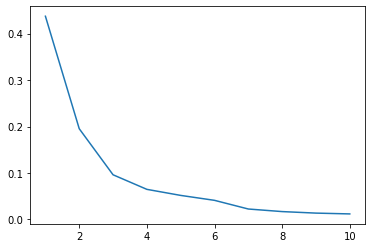
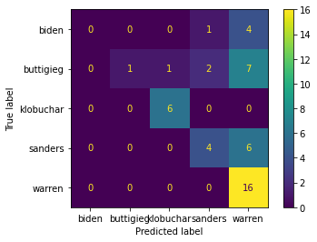
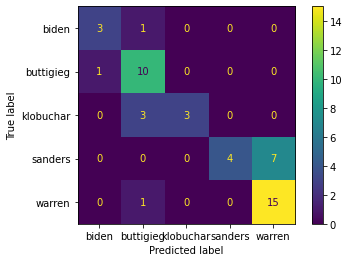

# Phase 4 Code Challenge Review: PCA and NLP

TOC:

  - [PCA](#pca)
  - [NLP](#nlp)


<a id='pca'></a>

# PCA

When creating principle components, PCA aims to find a vector in the direction of our feature space that is fit to what?

> Your answer here

How is the 1st principle component related to the 2nd?

> Your answer here

What are some reasons for using PCA?


> Your answer here


```python
'''PCA can combat the curse of dimensionality.  
The curse of dimensionality occurs when there are a large number of features in a dataset.
Having too many features can mean that the signal of features can be lost.'''
```

> Your answer here


```python
"""PCA can help with interpretability of coefficients.  
Because all the features are created orthagonally to one another, 
PCA ensures that there is no multicollinearity.

"""
```

> Your answer here


```python
'''PCA can be useful for visualization.  
Because you can reduce the feature space to two or three dimensions, 
you can make plots that show things such as the decision boundary or the grouping of clusters.
'''
```

> Your answer here


```python
"""PCA may help combat overfitting.  
You are essentially simplifying the model to a certain number of features.
Reducing the complexity of the model can reduce variance"""
```


```python
'Can help reduce computing time'
```


    'Can help reduce computing time'


How can one determine how many principle components to use in a model?

> Your answer here


```python
"""We can look at the explained variance ratio. 
The explained variance ratio lookes at how much variance is explained by each component.  
The explained variance will always go up with more components, 
so choose components where we see the explained variance stop increasing significantly.
Make a plot that helps you choose a good number of components."
```


```python

"""Wrong solution b/c of no scaling"""
from sklearn.decomposition import PCA
from sklearn.preprocessing import StandardScaler


# instantiate a PCA object, and determine how much variance is explained by the first principal component.
from sklearn.model_selection import train_test_split

X_train, X_test, y_train, y_test = train_test_split(X,y,random_state=42)
pca_1 = PCA(n_components=1)
#ss = StandardScaler()
 
pca_1.fit(X_train)

sum(pca_1.explained_variance_ratio_)
```


    0.9818124290360914


```python
'''Looking at the components of a PCA object without scaling, we see that area is much larger.  Let us look at X.describe()'''
pca_1.components_
```


    array([[ 5.11157769e-03,  2.02572144e-03,  3.51774640e-02,
             5.24785181e-01,  4.37237521e-06,  3.74682600e-05,
             7.96622375e-05,  4.65437990e-05,  8.04117091e-06,
            -3.02201929e-06,  3.21671661e-04, -4.27906307e-05,
             2.27254345e-03,  5.78600982e-02, -6.80381229e-07,
             4.71335909e-06,  8.50572086e-06,  3.17526077e-06,
            -7.74887786e-07, -1.98850370e-07,  7.07676088e-03,
             2.89659323e-03,  4.86797536e-02,  8.47084134e-01,
             6.41856188e-06,  8.84930424e-05,  1.60369243e-04,
             7.07854059e-05,  1.90999538e-05,  2.57616027e-07]])


```python
pca = PCA(n_components=10)
ss = StandardScaler()
X_tr_sc = ss.fit_transform(X_train)
pca.fit(X_tr_sc)
pca.explained_variance_ratio_
```


    array([0.4373648 , 0.1953137 , 0.09618005, 0.06482796, 0.05180713,
           0.04118451, 0.0225213 , 0.01698476, 0.0137072 , 0.01197057])


```python
import matplotlib.pyplot as plt
plt.plot(range(1,11), pca.explained_variance_ratio_)
```


    [<matplotlib.lines.Line2D at 0x15fbc50d0>]





<a id='nlp'></a>


# NLP

For NLP data, what is the entire data of records called?

> your answer here

What is an individual record called?

> your answer here

What is a group of two words that appear next to one-another in a document?

> Your answer here

What is a high frequency, semantically low value word called? 

> Your answer here

List the preprocessing steps we can employ to create a cleaner feature set to our models.

> Your answer here

What sklearn tools do we have at our disposal to turn our raw text into numerical representations?

> Your Answer here

Explain the difference between the two main vectorizors we employ to transform the data into the document-term matrix.

> Your answer here

What form do the two main vectorizors expect our data to be fed to them?

> Your answer here

Now let's write some code.


```python
X = policies['policy']
y = policies['candidate']

y.value_counts()
```


    warren       75
    buttigieg    37
    sanders      34
    klobuchar    25
    biden        18
    Name: candidate, dtype: int64


```python
from sklearn.naive_bayes import MultinomialNB
from sklearn.feature_extraction.text import CountVectorizer
from sklearn.metrics import plot_confusion_matrix
X_train, X_test, y_train, y_test = train_test_split(X,y)

cv = CountVectorizer()
mnb = MultinomialNB()

mnb.fit(cv.fit_transform(X_train), y_train)
mnb.score(cv.transform(X_test), y_test)
plot_confusion_matrix(mnb,cv.transform(X_test), y_test )
```


    <sklearn.metrics._plot.confusion_matrix.ConfusionMatrixDisplay at 0x16225aa90>





```python
from sklearn.ensemble import RandomForestClassifier
X_train, X_test, y_train, y_test = train_test_split(X,y)

cv = CountVectorizer()
rf = RandomForestClassifier()

rf.fit(cv.fit_transform(X_train), y_train)
rf.score(cv.transform(X_test), y_test)
plot_confusion_matrix(rf,cv.transform(X_test), y_test )
```


    <sklearn.metrics._plot.confusion_matrix.ConfusionMatrixDisplay at 0x162296e80>




